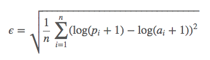

# price_prediction

Case Study on Tractor Pricing
======================

The goal is to predict the sale price of a particular piece of
tractor at auction based on its usage, equipment type, and
configuration.  The data is sourced from auction result postings and includes information on usage and equipment configurations.

Evaluation
======================
The evaluation of the model will be based on Root Mean Squared Log Error.
Which is computed as follows:

where *pi* are the predicted values and *ai* are the
target values.

This loss function is sensitive to the percentage different between actual and predicted values. This is intended to avoid large errors simply becuase of higher prices if other metrics based on absolute errors were used.

Elastic Net was initially used for the simplicity of linear models, but linear realtionship was not apparent, result in an error rate of around 0.5. Random Forest had a better error rate of 0.32. Cross validation was also used to tune the parameters, but the default parameters had the best result.

During the data exploration, there was an interesting discovery regarding age. Prices decrease as age increases until machines are antique (> 60). Antique machines were of a small population with higher prices. This dataset also had negative ages and ages over 1000 years. These rows were removed. Please see details in code.

(images/Sales_Price_By_Age.png)

* Data for this case study comes from Galvanize 
https://github.com/gSchool/dsi-regression-case-study

